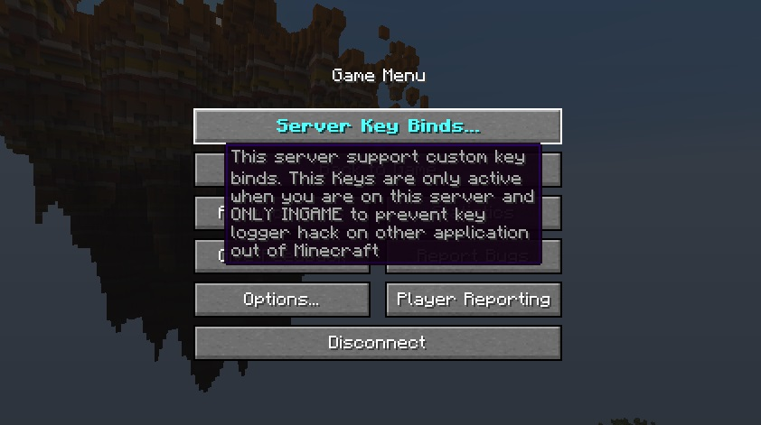

[](https://ko-fi.com/R6R3VYU8L)
---

**ServerKeyboardBridge** allow the server (Paper) to receive custom key press by the client. Without this mod, servers are not able to know which keyboard key is pressed.

Supported Minecraft version for client: **1.20.1**
Supported Minecraft version for server: **almost all ?**

# Usage:
## client
When you connect to a compatible server, you can find a new button on the game pause menu. This button is for key bidings.
The server will receive the pressed key information and perform some logic in response (example: spawn your horse when you press H).

## server
in your build.gradle:
```gradle
repositories {
    maven { url "https://jitpack.io" } // Github repositories
}
dependencies {
    compileOnly //TODO
}
```

```java
    @Override
    public void onEnable() {
        if (Bukkit.getPluginManager().isPluginEnabled("ServerKeyboardBridge")) {
            // keyCode can be found here : https://www.glfw.org/docs/latest/group__keys.html
            // Do not use null value, use empty string instead.
            ServerKeyboardBridge.getInstance().registerKey(new KeyEntry(new NamespacedKey(plugin, id), name, description, category, defaultKeyCode));
        }
    }

    @EventHandler
    public void bridgeJoinEvent(BridgeJoinEvent event) {
        Player player = event.getPlayer();
        String version = event.getVersion();
    }

    // KeyPressedEvent, KeyReleasedEvent or KeyEvent for both
    @EventHandler
    public void keyPressed(KeyPressedEvent event) {
        Player player = event.getPlayer();
        NamespacedKey namespacedKey = event.getKey();
        boolean isPressed = event.isPressed(); // always true in KeyPressedEvent
    }
```

# Installation:
**Fabric**
1. Install [Fabric](https://fabricmc.net/use/installer/)
2. Download [Fabric API](https://www.curseforge.com/minecraft/mc-mods/fabric-api) and put it in your mods folder.
3. Download [ServerKeyboardBridge](https://github.com/Anarchick/ServerKeyboardBridge/releases) this realease contains 2 files for mod and server
4. Place the mod jar file in your mods folder

**Paper**
1. Download [ServerKeyboardBridge](https://github.com/Anarchick/ServerKeyboardBridge/releases) this realease contains 2 files for mod and server
2. Place the plugin jar file in your plugins folder of Paper

# Support
If you require support or have questions, open an issue on this GitHub repo.

# Q&A
**Q. Does all pressed keys are sent to the server ?**
A. No! Only configured keys from other plugins with a limit.

**Q. Are pressed keys sending when I'm using other programs like Google Chrome ?**
A. No! Keys are sent only when you are in Minecraft to prevent key logger hack, the Minecraft chat is also not recorded.

**Q. Did you plan to make it compatible with other loaders like Forge ?**
A. No :/

**Q. Does it support Quilt ?**
A. Yes! The majority of Fabric mods are compatible with Quilt.

**Q. Did it support Spigot or Bukkit servers ?**
A. No. You have to use Paper or a fork of Paper

**Q. Can I use translatable text ?**
A. Yes! Available for name, description and category

**Q. What is the difference between the AriKeys Mod ?**
A. Almost the same utility ¯\_(ツ)_/¯ It's my first mod, I have to practice my skills from somewhere. I think ServerKeyboardBridge is easier to read and maintain at times. And NO, ServerKeyboardBridge is not a fork of AriKeys! Of curse that some code is similar because it's maybe the only way for some things.

**Q. Can I use it in a modpack or in a video ?**
A. Yes! I appreciate if you notice me in the description :D

